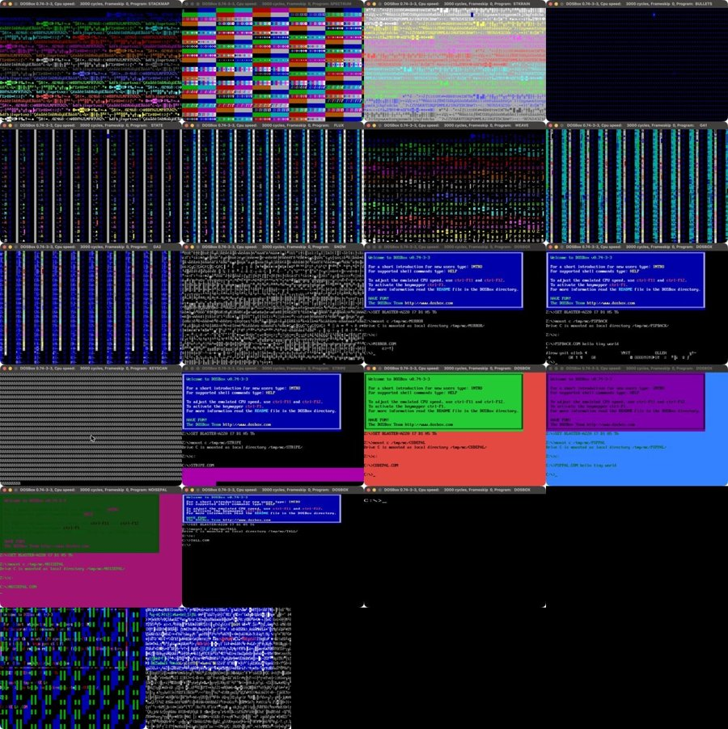
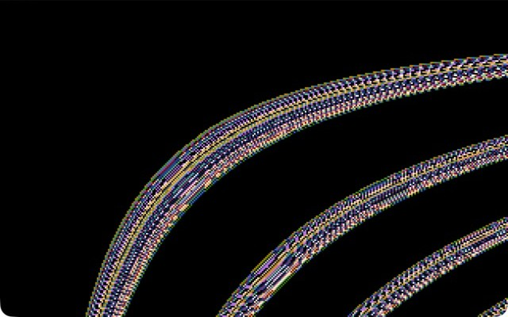
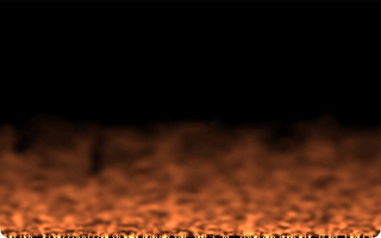
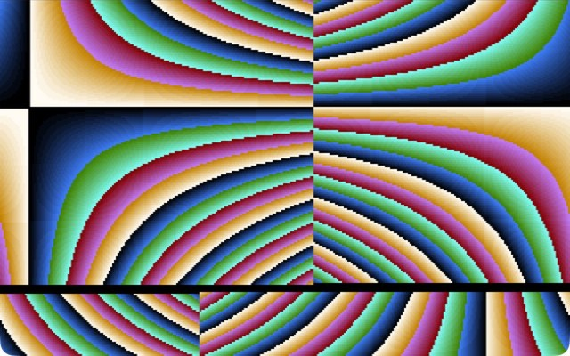
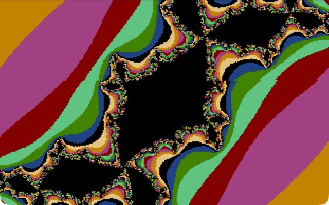
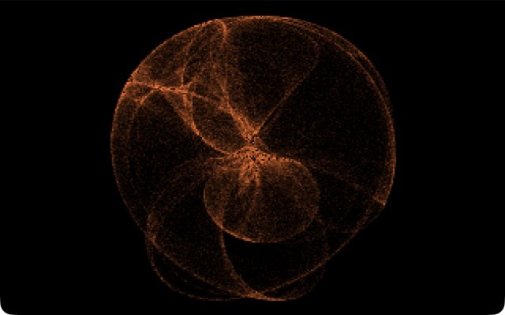
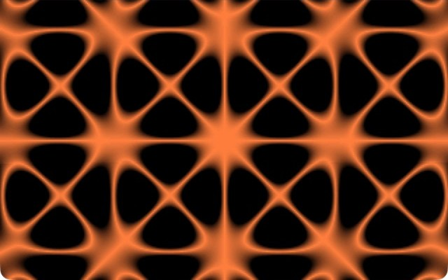
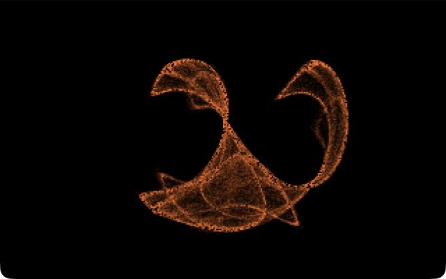
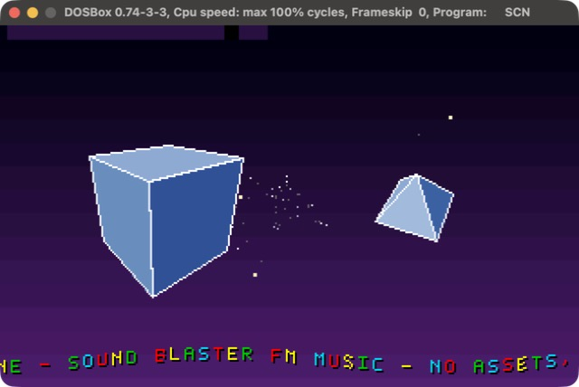

# UBER tiny demos

**The index of a family of DOS size-coding demos in x86 assembly: 41 programs in 7 repositories, from 4 bytes to 11 KB.**

Each program is a flat 16-bit real-mode `.COM` file with no assets and no libraries. Every repository has its own build gate
(a size budget that stops a program growing back), an emulated-CPU test suite, CI, and tag-driven releases with checksums.
This repository is only the map: a size ladder, an inventory, and the tricks the programs share.

| | |
|---|---|
| **41** programs | **29** are under 9 bytes, **40** are 256 bytes or less |
| **4 bytes** | the smallest (`BIG.COM`: 40x25 text mode) |
| **11,179 bytes** | the largest (`UBERSHOW.COM`: a 20-scene show with 3D and FM music) |

The full, generated list of every program with its size and one-line description is in **[INVENTORY.md](INVENTORY.md)**.

## The size ladder (the headline demos)

Everything here runs in [DOSBox](https://www.dosbox.com/) (or on VGA hardware); download a `.COM` from the repo's latest release.

| | Demo | Size | Class | What it does |
|---|---|---:|---|---|
|  | **[29 micro demos](https://github.com/djayuffe/uber-micro-demos)** | **4 to 8 bytes** | 8 | the stack pointed at the screen, a program that prints itself, found-by-evolution screens, a pulsing cursor, speaker noise, two programs in the same eight bytes |
|  | **[UBER10](https://github.com/djayuffe/uber10-dos-demo)** | **10 bytes** | 16 | the 256 CP437 glyphs scrolling at a readable pace, with sound |
|  | **[SELFTEX](https://github.com/djayuffe/uber256-lab)** | **77 bytes** | 128 | the program's own machine code, used as a scrolling texture |
|  | **[UBER128](https://github.com/djayuffe/uber128-dos-demo)** | **77 bytes** | 128 | rainbow rings flowing out of the screen centre |
|  | **[FIRE](https://github.com/djayuffe/uber256-lab)** | **123 bytes** | 128 | framebuffer-feedback fire with a generated palette and an LCG noise source |
|  | **[MOIRE](https://github.com/djayuffe/uber256-dos-intro)** | **131 bytes** | 256 | two ring families, one orbiting the other, XORed into a moire |
|  | **[ESCHER](https://github.com/djayuffe/uber256-lab)** | **137 bytes** | 256 | the picture is drawn once; only the CRT controller's start address and line compare move, folding a hyperbolic texture into an impossible patchwork |
|  | **[JULIA](https://github.com/djayuffe/uber256-lab)** | **161 bytes** | 256 | a Julia set in 8.8 fixed point, no FPU, its constant orbiting on a Minsky oscillator |
|  | **[UBER256](https://github.com/djayuffe/uber256-rotozoomer)** | **171 bytes** | 256 | an XOR rotozoomer with no multiplies and no sine table |
|  | **[GALAXY](https://github.com/djayuffe/uber256-lab)** | **205 bytes** | 256 | a de Jong strange attractor on the x87 FPU, glowing, fading and morphing |
|  | **[CHLADNI](https://github.com/djayuffe/uber256-lab)** | **224 bytes** | 256 | the nodal lines of a vibrating plate on the FPU, with drifting mode numbers that also tune the speaker |
|  | **[CLIFF](https://github.com/djayuffe/uber256-lab)** | **210 bytes** | 256 | the same engine with Clifford-attractor equations |
|  | **[UBERSHOW](https://github.com/djayuffe/uber40k-dos-demo)** | **11,179 bytes** | 40K | a 20-scene show: a real 3D engine, a lookup-table effects engine, kick-synced effects and Sound Blaster FM music |

*Class* is the size category the program was built for (8 / 16 / 128 / 256 bytes, or a 40 KB budget). Several beat their class by a wide margin.

## The repositories

| Repository | What is in it | Programs | Latest |
|---|---|---:|---|
| [uber-micro-demos](https://github.com/djayuffe/uber-micro-demos) | the under-9-byte collection, with the notes on the found-memory and overlapping-instruction ideas | 29 | v1.8.0 |
| [uber256-lab](https://github.com/djayuffe/uber256-lab) | experiments in the 256-byte class: two attractors, a Chladni plate, a fire, an integer Julia set, a CRTC-only animation, a self-code texture | 7 | v1.4.0 |
| [uber10-dos-demo](https://github.com/djayuffe/uber10-dos-demo) | the 10-byte glyph scroller | 1 | v1.1.0 |
| [uber128-dos-demo](https://github.com/djayuffe/uber128-dos-demo) | the 77-byte ring tunnel | 1 | v1.0.0 |
| [uber256-dos-intro](https://github.com/djayuffe/uber256-dos-intro) | MOIRE, 131 bytes | 1 | v1.1.0 |
| [uber256-rotozoomer](https://github.com/djayuffe/uber256-rotozoomer) | the 171-byte rotozoomer | 1 | v1.0.0 |
| [uber40k-dos-demo](https://github.com/djayuffe/uber40k-dos-demo) | the big show (about 11 KB) | 1 | v1.4.0 |
| [uber256-megademo](https://github.com/djayuffe/uber256-megademo) | the earlier 18-scene line of the big show, superseded by uber40k-dos-demo | | |

## The hacks the programs share

DOS enters a `.COM` with `AX = 0` and `BX = 0` (and, in DOSBox, `SI = 0100h`), so `mov al,13h` is a complete mode set and `BL` is a ready-made
palette index and frame counter. The tricks that recur across the family:

- **Palette by code.** The VGA BIOS leaves the DAC write index at 0 after a mode set, so a palette is streamed straight to port `3C9h`; the DAC keeps
  only 6 bits, so `R = i, G = 2i, B = 4i` is a whole dense 256-colour palette in 12 bytes, and a `shr` chain gives a black-red-orange-white glow.
- **The segment is the screen.** `DI` runs over the whole 64 KB segment and wraps to 0 by itself, one `DIV` by 320 gives x and y, and squared distance
  replaces a square root.
- **The stack is the screen.** Point `SS` at the text page and `push` paints it (STACKMAP, STKRAIN, BULLETS and the evolved EVO1 and EVO2).
- **Strange attractors on the FPU.** Iterate a 2D map thousands of times, add light to the pixel under each point, fade the screen a little each frame
  (GALAXY, CLIFF): the accumulation buffer is the image.
- **Feedback with an energy source.** Each pixel becomes an average of its neighbours; random heat injected at the edge keeps it alive (FIRE). Without a source the
  screen averages itself to black.
- **Integer fractals.** 8.8 fixed point with `imul` / `shrd` replaces the FPU (JULIA), and a Minsky oscillator (`x += y>>5; y -= x>>5`) gives a circle with no sine table.
- **The program as data.** Its own bytes make a texture (SELFTEX) or a palette (CODEPAL); DOS's Program Segment Prefix is read backwards (PSPBACK).
- **Overlapping instructions.** A jump into the middle of an instruction makes the same bytes two programs; one byte picks the operation (OVERLAP, OVERSUB, OVERHEAR).
- **The CRT controller as an animator.** Draw once, then move only the display start address and line compare: three port writes move the whole image (ESCHER).
- **Hardware does the work.** One BIOS or port call (`BIG`, `TALL`, the PC-speaker demos) changes the machine, and the effect can outlive the program.

## How the family is tested and released

Every program in the table has an emulated-CPU test ([Unicorn](https://www.unicorn-engine.org/)) that runs the real binary, entered the way DOS enters a `.COM`,
and checks its hardware behaviour: video mode, palette, port writes, memory it touches, animation between frames and a clean exit. Each demo was also run in real
DOSBox for its screenshot, because an emulator test cannot tell whether something looks right. A tag push builds, re-tests and publishes the `.COM` files with `SHA256SUMS`.
Things no test here can judge are said plainly in each README: for example, how the speaker demos *sound* has not been listened to.

## Keeping the inventory current

[INVENTORY.md](INVENTORY.md) is generated from each repository's latest GitHub release and README, not typed by hand:

```sh
tools/gen_inventory.py > INVENTORY.md      # needs the gh CLI, signed in
```

Run it after publishing a release and commit the result.

## History

This repository started as the single home of the first three demos (v1.0.0: 8 / 118 / 237 bytes; v1.1.0: 5 / 79 / 171 bytes; those releases still carry
the binaries). The demos now live in their own repositories, where they were shrunk further, and this one is the index.
See [CHANGELOG.md](CHANGELOG.md).

## License

MIT
