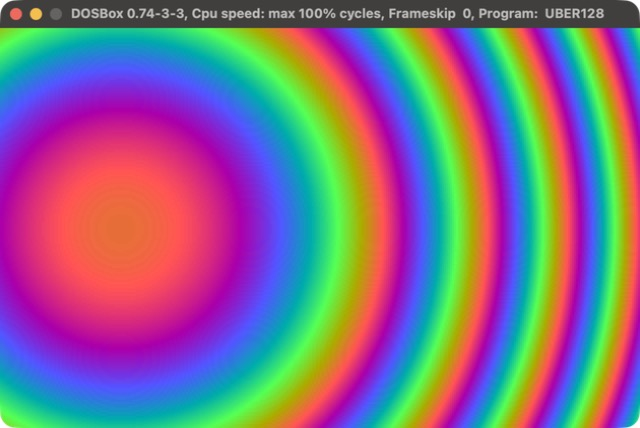
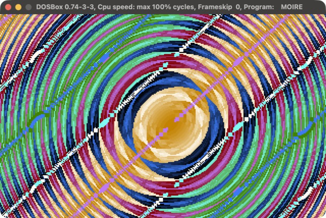
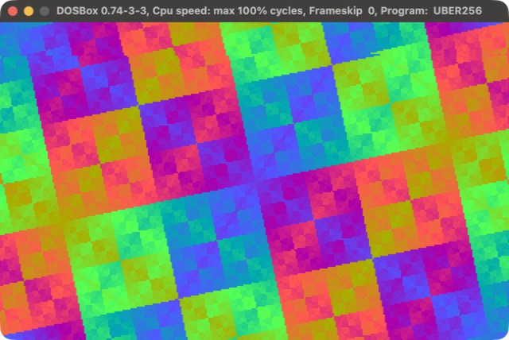

# UBER tiny demos

**An index of DOS size-coding demos in x86 assembly: 10, 77, 131 and 171 bytes, each in its own repository.**

Each demo is a single `.COM` file with no assets and no libraries, and has its own repo with a build
gate that stops it growing back, an emulated-CPU test, CI, and tag-driven releases.

| | Demo | Size | Class | What it does |
|---|---|---|---|---|
|  | **[UBER10](https://github.com/djayuffe/uber10-dos-demo)** | **10 bytes** | 16 | the 256 CP437 glyphs scrolling at a readable pace, with sound |
|  | **[UBER128](https://github.com/djayuffe/uber128-dos-demo)** | **77 bytes** | 128 | rainbow rings flowing out of the screen centre |
|  | **[MOIRE](https://github.com/djayuffe/uber256-dos-intro)** | **131 bytes** | 256 | two ring families, one orbiting the other, XORed into a moire |
|  | **[UBER256](https://github.com/djayuffe/uber256-rotozoomer)** | **171 bytes** | 256 | an XOR rotozoomer with no multiplies and no sine table |

Download a `.COM` from a repo's latest release and run it in [DOSBox](https://www.dosbox.com/).

## Even smaller

[**uber-micro-demos**](https://github.com/djayuffe/uber-micro-demos): ten demos, each **under 9 bytes**: the stack
pointed at the screen, a RAM x-ray, a pulsing cursor, a blizzard of glyphs, and four that make noise.

## The big one

[**uber40k-dos-demo**](https://github.com/djayuffe/uber40k-dos-demo): a 20-scene show with a real 3D engine,
a lookup-table effects engine, kick-synced effects and Sound Blaster FM music, in about 11 KB.

## The hacks the small ones share

DOS enters a `.COM` with `AX = 0` and `BX = 0`, so `mov al,13h` is a complete mode set and `BL` is a ready-made
palette index and frame counter. The VGA BIOS leaves the DAC write index at 0 after a mode set, so a palette is
streamed straight to port `3C9h`, and the DAC keeps only 6 bits, so `R = i, G = 2i, B = 4i` is a whole dense
256-colour palette in 12 bytes. `DI` can run over the whole 64 KB segment and wrap to 0 by itself, one `DIV` by
320 gives x and y, and squared distance replaces a square root. Each repo explains its own tricks.

## History

This repository started as the single home of the first three demos (v1.0.0: 8 / 118 / 237 bytes; v1.1.0:
5 / 79 / 171 bytes; the releases still carry those binaries). The demos now live in their own repositories,
where they were shrunk further, and this one is only the index.

## License

MIT
